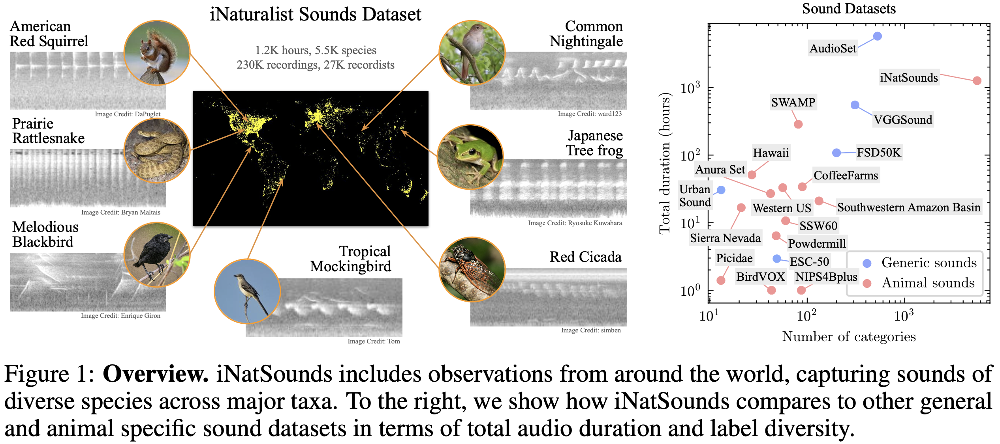
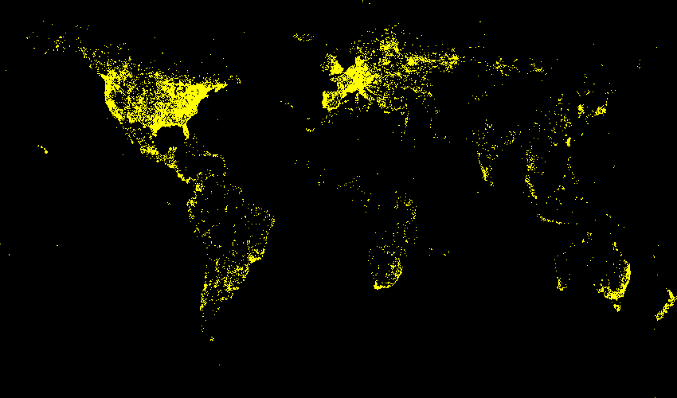
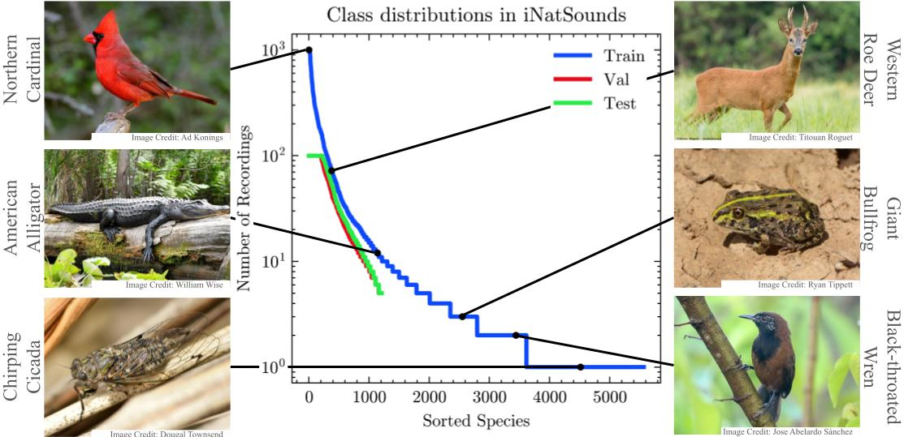

# The iNaturalist Sounds Dataset



We present the iNaturalist Sounds Dataset (iNatSounds), a collection of 230,000 audio files capturing sounds from over 5,500 species, contributed by more than 27,000 recordists worldwide. The dataset encompasses sounds from birds, mammals, insects, reptiles, and amphibians, with audio and species labels derived from observations submitted to iNaturalist, a global citizen science platform. Each recording in the dataset varies in length and includes a single species annotation. We benchmark multiple backbone architectures, comparing multiclass classification objectives with multilabel objectives. Despite weak labeling, we demonstrate that iNatSounds serves as a robust pretraining resource, achieving high performance relative to alternatives on strongly labeled downstream evaluation datasets. The dataset is available as a single, freely accessible archive, promoting accessibility and research in this important domain. We envision models trained on this data powering next-generation public engagement applications, and assisting biologists, ecologists, and land use managers in processing large audio collections, thereby contributing to the understanding of species compositions in diverse soundscapes.

## Details


| Super Category | Train | Train | Val/Test | Val | Test |
| ---- | ---- | ---- | ---- | ---- | ---- |
| | **Species** | **Audio** | **Species** | **Audio** | **Audio** |
Aves| 3,846 | 111,059 | 939 | 37,598 | 41,044 
Insecta| 745 | 10,080 | 111 | 3,065 | 3,306 
Amphibia| 650| 13,194 | 118 | 4,005 | 4,082 
Mammalia|296| 2,566 | 41 | 983 | 1,073 
Reptilia| 32 | 154 | 3 | 49 | 32 
||||||
**Total**| 5,569 | 137,062 | 1,212 | 45,701 | 49,537





## Evaluation

We evaluate at the "file-level", i.e. a single prediction and label is expected from an entire audio recording. We compute the following metrics
1. Class Averaged Top-1: Top-1 accuracy is computed for each class separately and then averaged
2. Class Averaged Top-5: Top-5 accuracy is computed for each class separately and then averaged
3. mAP: AP is computed for each class separately and then averaged
4. mF1: F1-score is computed for each class by choosing the threshold maximising F1 (there may be different thresholds for different classes). These F1 scores are averaged


## Guidelines

## Annotation Format

```
{
  "info" : info,
  "audio" : [audio],
  "categories" : [category],
  "annotations" : [annotation],
  "licenses" : [license]
}

info{
  "year" : int,
  "version" : str,
  "description" : str,
  "contributor" : str,
  "url" : str,
  "date_created" : str,
}

audio{
  "id" : int,
  "duration" : float,
  "file_name" : str,
  "license" : int,
  "rights_holder" : str,
  "date": str,
  "latitude": float,
  "longitude": float,
  "location_uncertainty": int,
}

category{
  "id" : int,
  "name" : str,
  "common_name" : str,
  "supercategory" : str,
  "kingdom" : str,
  "phylum" : str,
  "class" : str,
  "order" : str,
  "family" : str,
  "genus" : str,
  "specific_epithet" : str,
  "image_dir_name" : str,
}

annotation{
  "id" : int,
  "image_id" : int,
  "category_id" : int
}

license{
  "id" : int,
  "name" : str,
  "url" : str
}
```

### Annotation Format Notes:

## Terms of Use
By downloading this dataset you agree to the following terms:

1. You will abide by the [iNaturalist Terms of Service](https://www.inaturalist.org/pages/terms).
2. You will use the data only for non-commercial research and educational purposes.
3. You will NOT distribute the dataset recordings.
4. UMass Amherst makes no representations or warranties regarding the data, including but not limited to warranties of non-infringement or fitness for a particular purpose.
5. You accept full responsibility for your use of the data and shall defend and indemnify UMass Amherst, including its employees, officers and agents, against any and all claims arising from your use of the data, including but not limited to your use of any copies of copyrighted images that you may create from the data.

## Data

The dataset files are available through the AWS Open Data Program:
  * [Train Recordings [GB]](https://ml-inat-competition-datasets.s3.amazonaws.com/2021/train.tar.gz)
      * s3://ml-inat-competition-datasets/2021/train.tar.gz
      * Running `md5sum train.tar.gz` should produce `e0526d53c7f7b2e3167b2b43bb2690ed`
      * Recordings have a sample rate of 22.05kHz and have been converted to WAV format
      * Untaring the recordings creates a directory structure like `train/category/recording.wav`. This may take a while.
  * [Train Annotations [MB]](https://ml-inat-competition-datasets.s3.amazonaws.com/2021/train.json.tar.gz)
      * s3://ml-inat-competition-datasets/2021/train.json.tar.gz
      * Running `md5sum train.json.tar.gz` should produce `38a7bb733f7a09214d44293460ec0021`
  * [Validation Recordings [GB]](https://ml-inat-competition-datasets.s3.amazonaws.com/2021/val.tar.gz)
      * s3://ml-inat-competition-datasets/2021/val.tar.gz
      * Running `md5sum val.tar.gz` should produce `f6f6e0e242e3d4c9569ba56400938afc`
      * Recordings have a sample rate of 22.05kHz and have been converted to WAV format
      * Untaring the recordings creates a directory structure like `val/category/recording.wav`. This may take a while.
  * [Validation Annotations [MB]](https://ml-inat-competition-datasets.s3.amazonaws.com/2021/val.json.tar.gz)
      * s3://ml-inat-competition-datasets/2021/val.json.tar.gz
      * Running `md5sum val.json.tar.gz` should produce `4d761e0f6a86cc63e8f7afc91f6a8f0b`
  * [Test Recordings [GB]](https://ml-inat-competition-datasets.s3.amazonaws.com/2021/public_test.tar.gz)
      * s3://ml-inat-competition-datasets/2021/public_test.tar.gz
      * Running `md5sum test.tar.gz` should produce `7124b949fe79bfa7f7019a15ef3dbd06`
      * Recordings have a sample rate of 22.05kHz and have been converted to WAV format
      * Untaring the recordings creates a directory structure like `test/category/recording.wav`. This may take a while.
  * [Test Annotations [MB]](https://ml-inat-competition-datasets.s3.amazonaws.com/2021/public_test.json.tar.gz)
      * s3://ml-inat-competition-datasets/2021/public_test.json.tar.gz
      * Running `md5sum test.json.tar.gz` should produce `7a9413db55c6fa452824469cc7dd9d3d`
